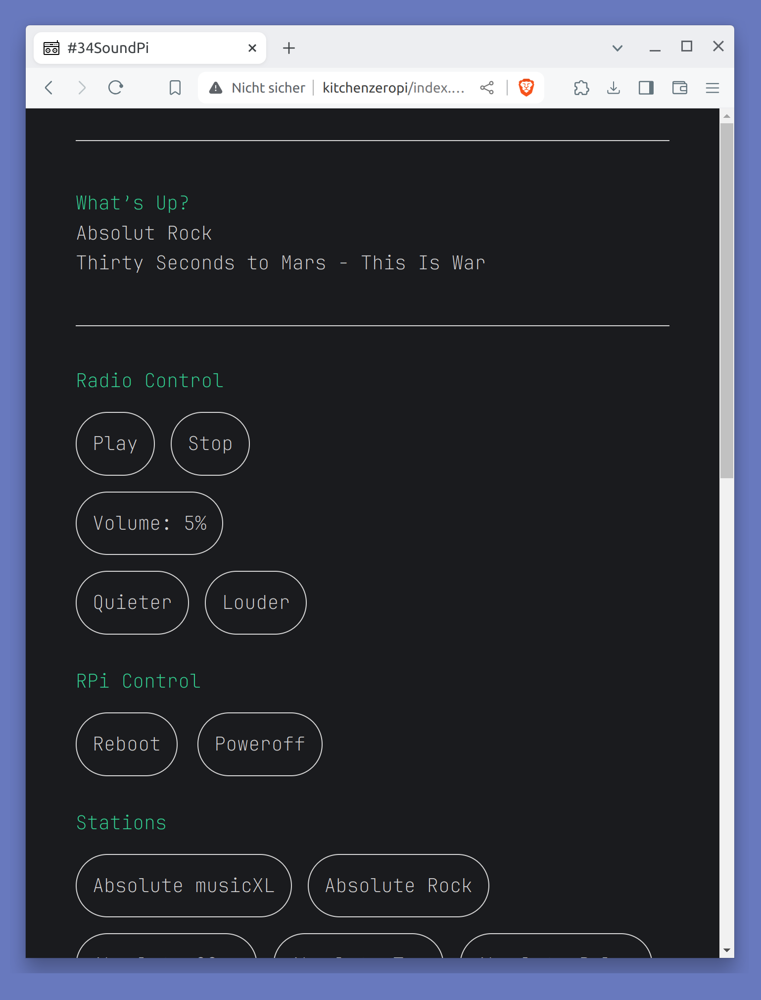

# SoundPi
WebUI für ein Webradio  
(headless Raspberry Pi Zero 2W mit HifiBerry miniAmp). 

<p> </p>

# Kurzanleitung

Alle Schritte kurz und knapp zusammengefasst.

## Bauteile

[https://raute34.de/webradio-der-plan](https://raute34.de/webradio-der-plan)

* Raspberry Pi Zero 2 W
* Steckerleiste
* HifiBerry MiniAmp
* Netzteil
* Lautsprecher
* SD Karte (mindestens 8GB)

## Raspberry Pi OS installieren

* [Raspberry Pi Imager](https://www.raspberrypi.com/software/) auf dem Desktop PC installieren. 
* Raspberry Pi OS Lite (64-bit) auf der SD-Karte installieren. Alle wichtigen Einstellungen vornehmen (Wlan, ssh, Host, Zeitzone ...) 

## raspi-config
* SD Karte in den Raspberry Pi stecken. Der erste Bootvorgang dauert etwas länger.
* Desktop per `ssh` mit dem Pi verbinden.
* Update und Upgrade ausführen mit: `sudo apt update && sudo apt dist-upgrade -y` 
* `sudo raspi-config`  starten und »Advanced Options --> Expand Filesystem« ausführen.
* Noch nicht neustarten.

## HifiBerry MiniAmp aktivieren

* Konfigurationsdatei öffnen mit: `sudo nano /boot/config.txt`
* `dtparam=audio=on`  -->  `# dtparam=audio=on`
*  `dtoverlay=hifiberry-dac` eintragen.
*  Speichern und Nano beenden mit: `Strg+s` und `Strg+x`
* Neustart mit: `sudo reboot`

## Software installieren

* Desktop per `ssh` mit dem Pi verbinden.
* [Raspotify](https://github.com/dtcooper/raspotify) am einfachsten mit dem Installationsskript installieren.
* Webserver und Player installieren mit: `sudo apt-get install apache2 php mpd mpc alsa-utils -y`

## mpc/mpd einstellen

* Konfigurationsdatei öffnen mit: `sudo nano /etc/mpd.conf`
* Ort der Playlist ändern: `/var/www/html/playlist`. (ohne »s« !)
* Audio Output Einstellung ändern:

```
# An example of an ALSA output:
#
audio_output {
        type            "alsa"
        name            "HifiBerry"
##      device          "hw:0,0"        # optional
        mixer_type      "software"      # optional
##      mixer_device    "default"       # optional
##      mixer_control   "PCM"           # optional
##      mixer_index     "0"             # optional
}
```

*  Speichern und nano beenden mit: `Strg+s` und `Strg+x`
* Neustart mit: `sudo reboot`


## WebUI einrichten

* Desktop per `ssh` mit dem Pi verbinden.
* Ordner wechseln mit: `cd /var/www/html/`
* Deinen Benutzer der Gruppe `www-data` hinzufügen mit: `sudo usermod -a -G www-data YOUR-USERNAME`.
* Berechtigungen ändern: `sudo chown -R www-data:www-data /var/www/html `
* Berechtigungen ändern: `sudo find  -type d -exec chmod 775 {} \;` (innerhalb /var/www/html/)
* Berechtigungen ändern: `sudo find  -type f -exec chmod 664 {} \;` (innerhalb /var/www/html/)
* Die Apache `index.thml` löschen mit:`sudo rm index.html`
* Ordner wechseln mit: `cd /home/YOUR-USERNAME/`
* WebUI von GitHub herunterladen: `curl -LO https://github.com/otto-sch/SoundPi/archive/refs/heads/main.zip`.
* Entpacken mit: `unzip main.zip`
* Dateien Kopieren: `sudo cp -a 'SoundPi-main/'* /var/www/html/`
* Ordner wechseln mit: `cd /var/www/html/`
* Berechtigungen ändern: `sudo chown -R www-data:www-data /var/www/html `
* Berechtigungen ändern: `sudo find  -type d -exec chmod 775 {} \;` (innerhalb /var/www/html/)
* Berechtigungen ändern: `sudo find  -type f -exec chmod 664 {} \;` (innerhalb /var/www/html/)
* Shutdown über WebUI erlauben:`sudo visudo` und `www-data ALL = NOPASSWD: /sbin/shutdown` eintragen.
*  Speichern und Nano beenden mit: `Strg+s` und `Strg+x`.
*  Playlist/Senderliste laden mit: `mpc load station`
*  Lautstärke von 100% auf 15% stellen:`mpc volume 15`
* `sudo reboot`
* Mit der IP von dem Raspberry Pi kann nun die WebUI aufgerufen werden.

## Radiolog

* Dateien kopieren: `sudo cp -a /var/www/html/scripts/ /usr/local/bin/`
* Ordner wechseln mit: `cd /usr/local/bin/scripts/`
* Dateien kopieren: `sudo cp -a soundpistart.service /lib/systemd/system/`
* Dateien kopieren: `sudo cp -a soundpistop.service /lib/systemd/system/`
* Berechtigungen ändern:`sudo chmod 644 /lib/systemd/system/soundpistart.service`
* Berechtigungen ändern:`sudo chmod 644 /lib/systemd/system/soundpistop.service`
* Berechtigungen ändern:`sudo chmod 750 /usr/local/bin/scripts/soundpistart.sh`
* Berechtigungen ändern:`sudo chmod 750 /usr/local/bin/scripts/soundpistop.sh`
* Service einschalten: `sudo systemctl enable soundpistart.service`
* Service einschalten:`sudo systemctl enable soundpistop.service`

have fun! &#127881;
